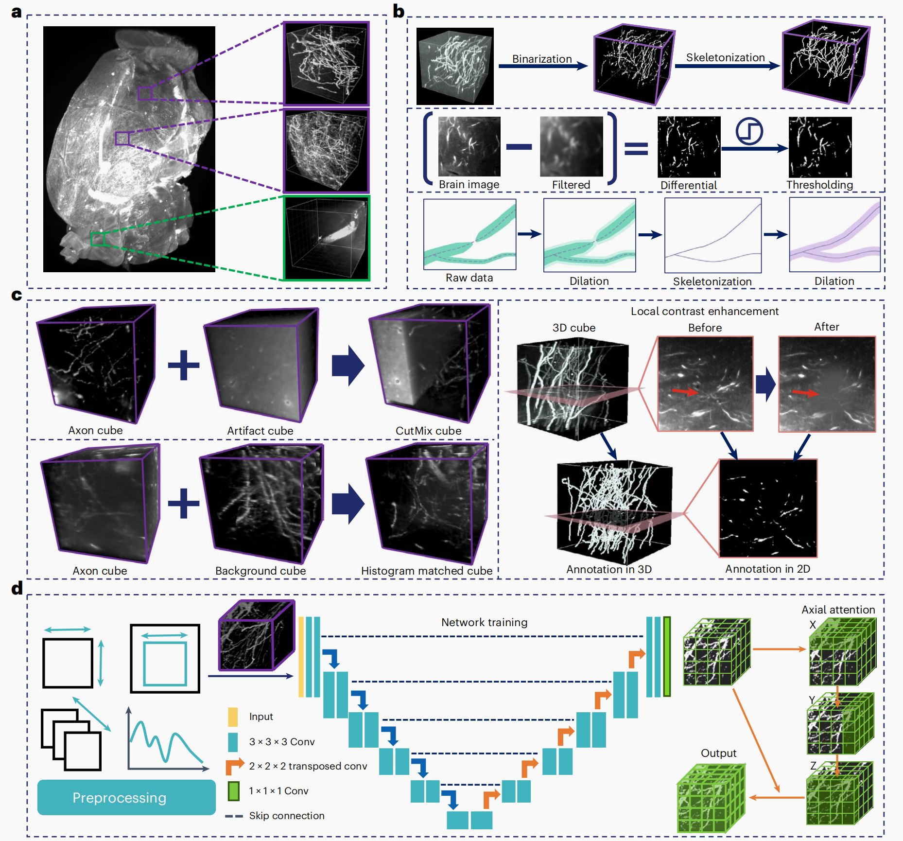
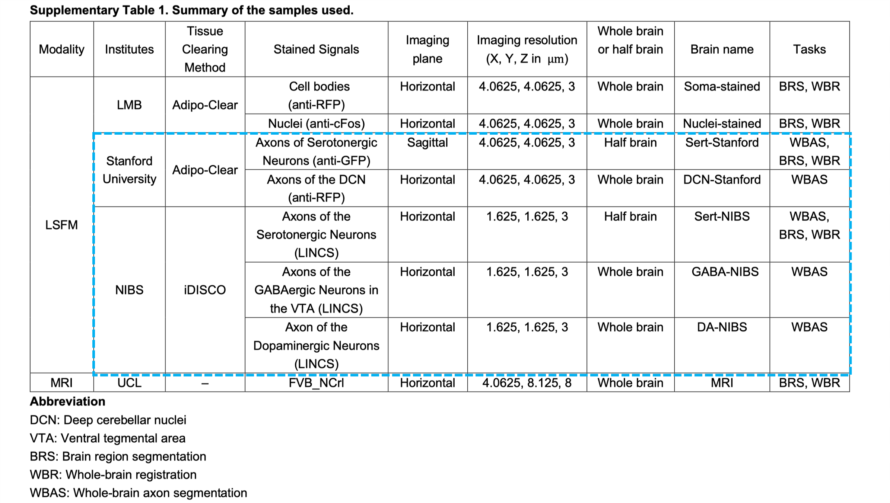

# Axon-Seg

#### **D-LMBmap: a fully automated deep-learning pipeline for whole-brain profiling of neural circuitry** 

*Zhongyu Li, Zengyi Shang, Jingyi Liu, Haotian Zhen, Entao Zhu, Shilin Zhong, Robyn N. Sturgess, Yitian Zhou, Xuemeng Hu, Xingyue Zhao, Yi Wu, Peiqi Li, Rui Lin & Jing Ren*



## Key Features

- Can achieve automated axon segmentation from small cubes to whole brain
- An automated axon annotation toolkit is provided, significantly reducing the workload of 3D labeling.
- Pre-trained models for segmenting five specific types of axons and comprehensive axon segmentation are available. These models can be utilized by users for application and fine-tuning within specialized tasks.

## Links

- [Paper](https://www.nature.com/articles/s41592-023-01998-6)
- [Model](https://drive.google.com/drive/folders/1vhuGGnnwYdZ_oDq2N0TOCqkUrrgOAC0l?usp=drive_link)
- [Code](https://github.com/lmbneuron/D-LMBmap/tree/main/Axon%20Segmentation) 

## Details

>Recent proliferation and integration of tissue-clearing methods and light-sheet fluorescence microscopy has created new opportunities to achieve mesoscale three-dimensional whole-brain connectivity mapping with exceptionally high throughput. With the rapid generation of large, high-quality imaging datasets, downstream analysis is becoming the major technical bottleneck for mesoscale connectomics. Current computational solutions are labor intensive with limited applications because of the exhaustive manual annotation and heavily customized training. In this repository, we provide an automated method for axon data annotation and segmentation, significantly reducing the workload of labeling. In addition, we offer segmentation models for five distinct types of axons, as well as a comprehensive axon segmentation model with enhanced generalizability, trained on a large dataset of axon cubes that encapsulates the features of all five axon types. Researchers can utilize these models for fine-tuning in subsequent personalized tasks.


## Dataset Links

Here, we provide the training data for five types of axons. Detailed information on their data sources, collection methods, and more is outlined below. The training data we utilized encompasses all data within the blue dashed lines.



The data volume information for the five datasets is as follows. We have trained segmentation models for each type of axon using these five datasets. Additionally, we have also trained a more generalized comprehensive model using a combined dataset from all five categories (4714 cubes after data augmentation). Please can download these models via the provided [model link](https://drive.google.com/drive/folders/1vhuGGnnwYdZ_oDq2N0TOCqkUrrgOAC0l?usp=drive_link) based on your specific needs.

|   Brain name   |   Whole-brain resolution   | No. of axon cubes | No. of artefact cubes | No. of cubes after data augmentation |        Cube Size        |                          Data link                           |
| :------------: | :------------------------: | :---------------: | :-------------------: | :----------------------------------: | :---------------------: | :----------------------------------------------------------: |
| Sert- Stanford | $2160\times2560\times2078$ |        46         |          54           |                 1040                 | $150\times150\times150$ | [link](https://drive.google.com/file/d/1YIWinuBUy11zOnAL1j0szptxMTVoyITd/view?usp=drive_link) |
|  DCN-Stanford  | $2160\times2560\times1892$ |        49         |          47           |                 725                  | $150\times150\times150$ | [link](https://drive.google.com/file/d/1Yuj1HS_gcERKsHQwEyFGmgCk20wwS00m/view?usp=drive_link) |
|   Sert-NIBS    | $7233\times7199\times1184$ |        86         |          10           |                 1024                 | $150\times150\times150$ | [link](https://drive.google.com/file/d/1ZDGdDyEEe3sEEguXR7E0ubJjBff4BWHK/view?usp=drive_link) |
|   GABA-NIBS    | $3753\times3748\times997$  |        91         |          45           |                 1452                 | $150\times150\times150$ | [link](https://drive.google.com/file/d/1U_yj5ovmtXOJZE50McJ17VQvgCC5Y6jv/view?usp=drive_link) |
|    DA-NIBS     | $3691\times3602\times1023$ |        84         |          100          |                 1156                 | $150\times150\times150$ | [link](https://drive.google.com/file/d/1Iw8nzv530L6NCinvMXvg2RwTF1PK-xx4/view?usp=drive_link) |

## Get Started

### **Main Requirements**  

> torch==1.11.0  
>
> torchvision==0.12.0
>
> nnUNet==1.7.0 
>
> timm==0.9.7

### **Installation**

```bash
git clone git@github.com:lmbneuron/D-LMBmap.git
cd "Axon Segmentation"
cd "Axon segmentation model training"
pip install -e .
pip install -r requirements.txt
```

Our models are built based on [nnUNet](https://github.com/MIC-DKFZ/nnUNet). Apart from above installation, please ensure that you meet the requirements of nnUNet.

### **Download Model**

Please download pre-trained models via the provided [model link](https://drive.google.com/drive/folders/1vhuGGnnwYdZ_oDq2N0TOCqkUrrgOAC0l?usp=drive_link) based on your specific needs.

### **Training cubes generation and data augmentation**

Before your training, make sure you have prepared the training cubes with automatically annotated masks and stored them as below.
Run `create_data.py`, in which base and source directories should be prepared ahead as below. *Note that the number of 
the skeletonized annotations, the automatically annotated masks and the axon cubes should be exactly the same.*

```
└── base(original training data)
　　 └── train
　 　 　　├── cropped-cubes(training axon cubes)
　　  　　│　　└──volume-001.tiff
　　  　　├── Rough-label(automatically annotated masks)
　　 　 　│　　└──label-001.tiff
　　  　　├── Fine-label(skeletonized annotation)
　　 　 　│　　└──label-001.tiff
　　 　 　└── artifacts(junk cubes)
　　 　　　　　└──volume-200.tiff
└── source(data used for histogram matching)
　　 └── train
　 　 　　├── cropped-cubes
　　  　　│　　└──volume-001.tiff
　　  　　├── Rough-label
　　 　 　│　　└──label-001.tiff
　　  　　├── Fine-label
　　 　 　│　　└──label-001.tiff
　　 　 　└── artifacts
　　 　　　　　└──volume-200.tiff
```

We propose three data augmentation methods, histogram matching, cutmix, and local contrast enhancement to augment training data. 
Change the parameters of function `histogram_match_data` in `create_data.py` to choose using histogram matching/cutmix/contrast enhancement or 
not. If you want to use histogram matching, it is better to set both **match_flag** and **join_flag** True so that both 
original cubes and matched cubes can be used for training.

```
cutmix=True  # use cutmix, mix up axon cubes and artifact cubes
match_flag=True, join_flag=True  # use histogram matching, join matched and original cubes
match_flag=True, join_flag=False  # use histogram matching, use only matched cubes
```

To run create_data.py:

```
python create_data.py --base BASE_PATH --source SOURCE_PATH --task_id ID --task_name TaskXXX_MYTASK
```

### **Preprocessing for training axon segmentation model**

After step 1 the raw training dataset will be in the folder prepared in step 0 (`DATASET/raw_data_base/nnUNet_raw_data/TaskXXX_MYTASK`, 
where task id `XXX` and task name `MYTASK` are set in `create_data.py`. 

For training our model, a preprocessing procedure is needed. Run this command:

```bash
nnUNet_plan_and_preprocess -t XXX
```

You will find the output in `DATASET/preprocessed/TaskXXX_MYTASK`. 
There are several additional input arguments for this command. Running `-h` will list all of them along with a description. If you run out of RAM during preprocessing, you may want to adapt the number of processes used with the `-tl` and `-tf` options. The default configuration make use of a GPU with 8 GB memory. Larger memory size can be used with options like `-pl3d ExperimentPlanner3D_v21_16GB`.

### **Training**

Our model trains all U-Net configurations in a 5-fold cross-validation. This enables the model to determine the postprocessing and ensembling (see next step) on the training dataset. 
Training models is done with the `nnUNet_train` command. The general structure of the command is:

```bash
nnUNet_train CONFIGURATION TRAINER_CLASS_NAME TASK_NAME_OR_ID FOLD --npz (additional options)
```

CONFIGURATION is a string that identifies the requested U-Net configuration. TASK_NAME_OR_ID specifies what dataset should be trained on and FOLD specifies which fold of the 5-fold-cross-validaton is trained. 

TRAINER_CLASS_NAME is the name of the model trainer. To be specific, a normal U-Net will be trained with TRAINER_CLASS_NAME `nnUNetTrainerV2`. 

We also propose networks with attention modules. You can use TRAINER_CLASS_NAME `MyTrainerAxial` to train a U-Net with attention modules. If you need to continue a previous training, just add a `-pretrained_weights` to the training command. For FOLD in [0, 1, 2, 3, 4], a sample command is: 

```
nnUNet_train 3d_fullres MyTrainerAxial TaskXXX_MYTASK FOLD -p nnUNetPlansv2.1_16GB --pretrained_weights PRETRAINED_MODEL
```

The trained models will be written to the `DATASET/trained_models/nnUNet` folder. Each training obtains an automatically generated output folder name `DATASET/preprocessed/CONFIGURATION/TaskXXX_MYTASKNAME/TRAINER_CLASS_NAME__PLANS_FILE_NAME/FOLD`. Multi GPU training is not supported.

### **Cube Prediction**

Once all 5-fold models are trained, use the following command to automatically determine what U-Net configuration(s) to use for test set prediction:

```bash
nnUNet_find_best_configuration -m 3d_fullres -t XXX --strict
```

This command will print a string to the terminal with the inference commands you need to use. The easiest way to run inference is to simply use these commands. For each of the desired configurations(e.g. 3d_fullres), run:

```
nnUNet_predict -i INPUT_FOLDER -o OUTPUT_FOLDER -t TASK_NAME_OR_ID -m CONFIGURATION --save_npz
```

Only specify `--save_npz` if you intend to use ensembling. `--save_npz` will make the command save the softmax probabilities alongside of te predicted segmentation masks requiring a lot of disk space. You can also use `-f` to specify folder id(s) if not all 5-folds has been trained. `--tr` option can be used to specify TRAINER_CLASS_NAME, which should be consistent with the class used in model training. A sample command using an U-Net with attention module to generate predictions is: 

```
nnUNet_predict -i INPUT_FOLDER -o OUTPUT_FOLDER -t XXX --tr MyTrainerAxial -m 3d_fullres -p nnUNetPlansv2.1_16GB
```

We extract the model weights from the saved checkpoint files(e.g. model_final_checkpoint.model) to `pth` files by running `python save_models.py`. The `pth` file will be used for whole brain axon prediction.

## 🙋‍♀️ Feedback and Contact

If you encounter any issues, please contact us at lipeiqi@stu.xjtu.edu.cn


## 🛡️ License

This work is licensed under a Creative Commons Attribution 4.0 International License

## 🙏 Acknowledgement

Our code is based on the [nnU-Net](https://github.com/MIC-DKFZ/nnUNet) framework. 

## 📝 Citation

If you find this repository useful, please consider citing this paper:

```
@article{li2023d,
  title={D-LMBmap: a fully automated deep-learning pipeline for whole-brain profiling of neural circuitry},
  author={Li, Zhongyu and Shang, Zengyi and Liu, Jingyi and Zhen, Haotian and Zhu, Entao and Zhong, Shilin and Sturgess, Robyn N and Zhou, Yitian and Hu, Xuemeng and Zhao, Xingyue and others},
  journal={Nature Methods},
  pages={1--12},
  year={2023},
  publisher={Nature Publishing Group US New York}
}
```

