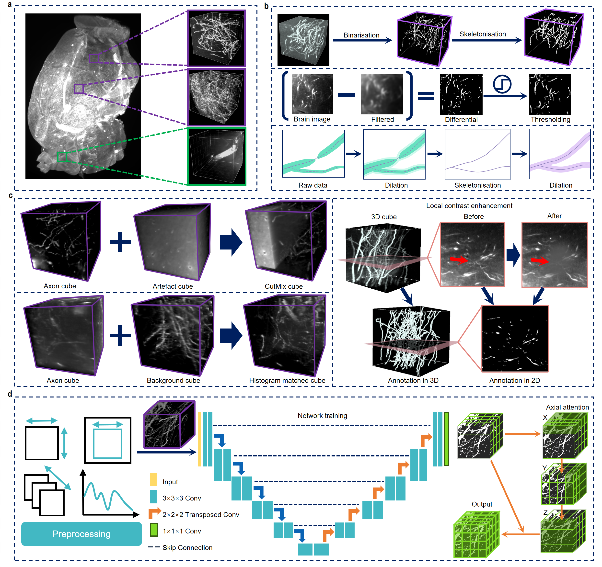

# Axon-Segmentation

#### **D-LMBmap: a fully automated deep-learning pipeline for whole-brain profiling of neural circuitry** 

*Zhongyu Li, Zengyi Shang, Jingyi Liu, Haotian Zhen, Entao Zhu, Shilin Zhong, Robyn N. Sturgess, Yitian Zhou, Xuemeng Hu, Xingyue Zhao, Yi Wu, Peiqi Li, Rui Lin & Jing Ren*



## Key Features

- Can achieve automated axon segmentation from small cubes to whole brain
- An automated axon annotation toolkit is provided, significantly reducing the workload of 3D labeling.
- Pre-trained models for segmenting five specific types of axons and comprehensive axon segmentation are available. These models can be utilized by users for application and fine-tuning within specialized tasks.

## Links

- [Paper](https://www.nature.com/articles/s41592-023-01998-6)
- [Model](https://drive.google.com/drive/folders/1vhuGGnnwYdZ_oDq2N0TOCqkUrrgOAC0l?usp=drive_link)
- [Code](https://github.com/lmbneuron/D-LMBmap/tree/main/Axon%20Segmentation) 

## Details

intro text here.

<!-- Insert a pipeline of your algorithm here if got one -->

<div align="center">
    <a href="https://"></a>
</div>


More intro text here.


## Dataset Links

Here, we provide the training data for five types of axons. Detailed information on their data sources, collection methods, and more is outlined below. The training data we utilized encompasses all data within the blue dashed lines.


The data volume information for the five datasets is as follows. We have trained segmentation models for each type of axon using these five datasets. Additionally, we have also trained a more generalized comprehensive model using a combined dataset from all five categories. You can download these models via the provided [model link](https://drive.google.com/drive/folders/1vhuGGnnwYdZ_oDq2N0TOCqkUrrgOAC0l?usp=drive_link) based on your specific needs.

| Brain name     | Whole-brain resolution   | No. of axon cubes | No. of artefact cubes | No. of cubes after data augmentation | Cube Size             | Data link                                                    |
| -------------- | ------------------------ | ----------------- | --------------------- | ------------------------------------ | --------------------- | ------------------------------------------------------------ |
| Sert- Stanford | 2160\times2560\times2078 | 46                | 54                    | 1040                                 | 150\times150\times150 | [link](https://drive.google.com/file/d/1YIWinuBUy11zOnAL1j0szptxMTVoyITd/view?usp=drive_link) |
| DCN-Stanford   | 2160\times2560\times1892 | 49                | 47                    | 725                                  | 150\times150\times150 | [link](https://drive.google.com/file/d/1Yuj1HS_gcERKsHQwEyFGmgCk20wwS00m/view?usp=drive_link) |
| Sert-NIBS      | 7233\times7199\times1184 | 86                | 10                    | 1024                                 | 150\times150\times150 | [link](https://drive.google.com/file/d/1ZDGdDyEEe3sEEguXR7E0ubJjBff4BWHK/view?usp=drive_link) |
| GABA-NIBS      | 3753\times3748\times997  | 91                | 45                    | 1452                                 | 150\times150\times150 | [link](https://drive.google.com/file/d/1U_yj5ovmtXOJZE50McJ17VQvgCC5Y6jv/view?usp=drive_link) |
| DA-NIBS        | 3691\times3602\times1023 | 84                | 100                   | 1156                                 | 150\times150\times150 | [link](https://drive.google.com/file/d/1Iw8nzv530L6NCinvMXvg2RwTF1PK-xx4/view?usp=drive_link) |


## Get Started

**Main Requirements**  

> torch==1.11.0  
>
> torchvision==0.12.0
>
> nnUNet==1.7.0 
>
> timm==0.9.7

**Installation**

```bash
git clone git@github.com:lmbneuron/D-LMBmap.git
cd Axon Segmentation
cd "Axon segmentation model training"
pip install -e .
```

**Download Model**

**Preprocess**

```bash
python DDD
```


**Training**

```bash
python DDD
```


**Validation**

```bash
python DDD
```


**Testing**

```bash
python DDD
```

## 🙋‍♀️ Feedback and Contact

- If you encounter any issues, please contact us at lipeiqi@stu.xjtu.edu.cn


## 🛡️ License

This work is licensed under a Creative Commons Attribution 4.0 International License

## 🙏 Acknowledgement

Our code is based on the [nnU-Net](https://github.com/MIC-DKFZ/nnUNet) framework. 

## 📝 Citation

If you find this repository useful, please consider citing this paper:

```
@article{John2023,
  title={paper},
  author={John},
  journal={arXiv preprint arXiv:},
  year={2023}
}
```

